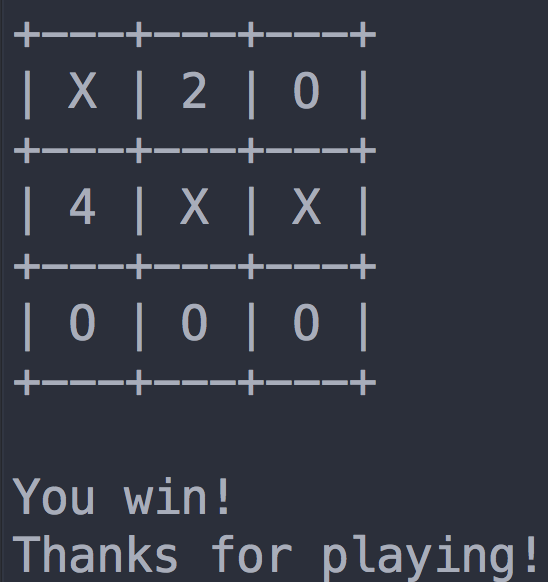
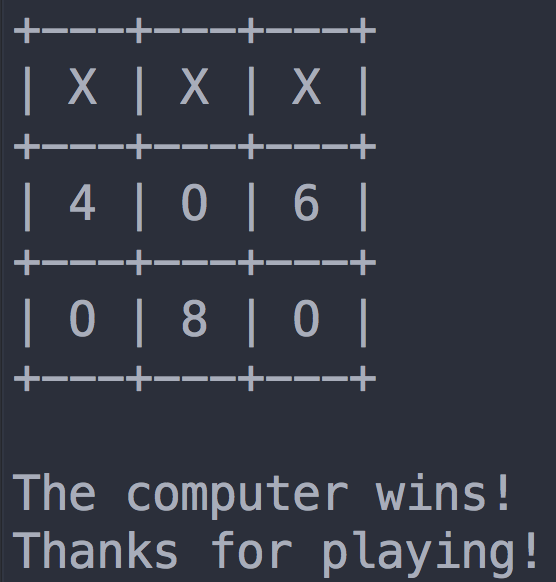
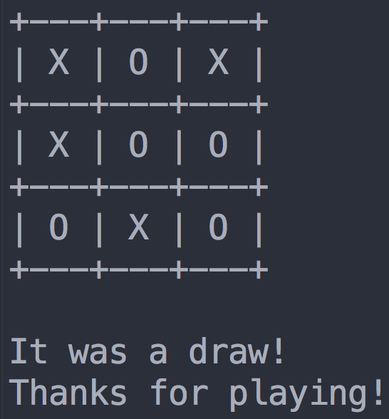

#TicTacToe

Bored, tired, or just need a break? Play a quick game of tic tac toe against your computer in the command line!

Programmed in Haskell with :heart: at Hack the North 2015.

#Usage

	$ cabal update
	$ cabal install Tic-Tac-Toe
	$ Tic-Tac-Toe

#Screenshots

TicTacToe in Haskell. Created with :heart: at Hack The North 2015. 